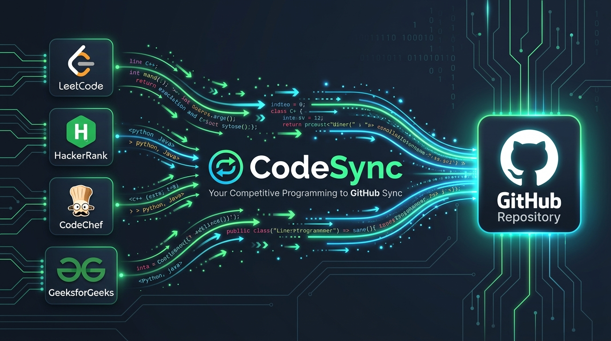
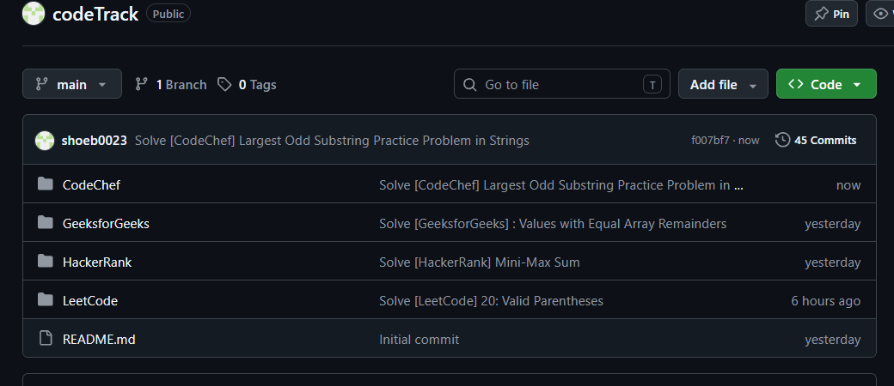
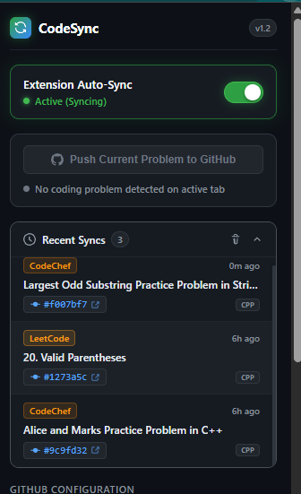
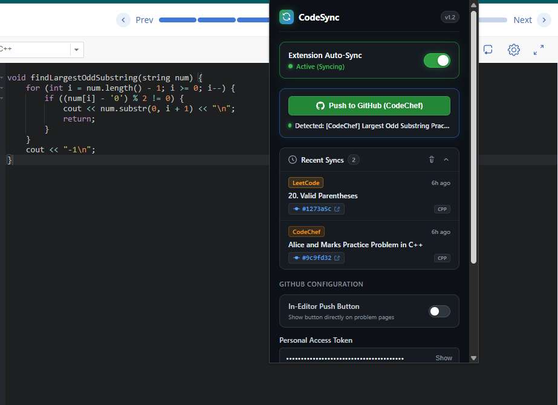
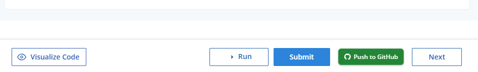
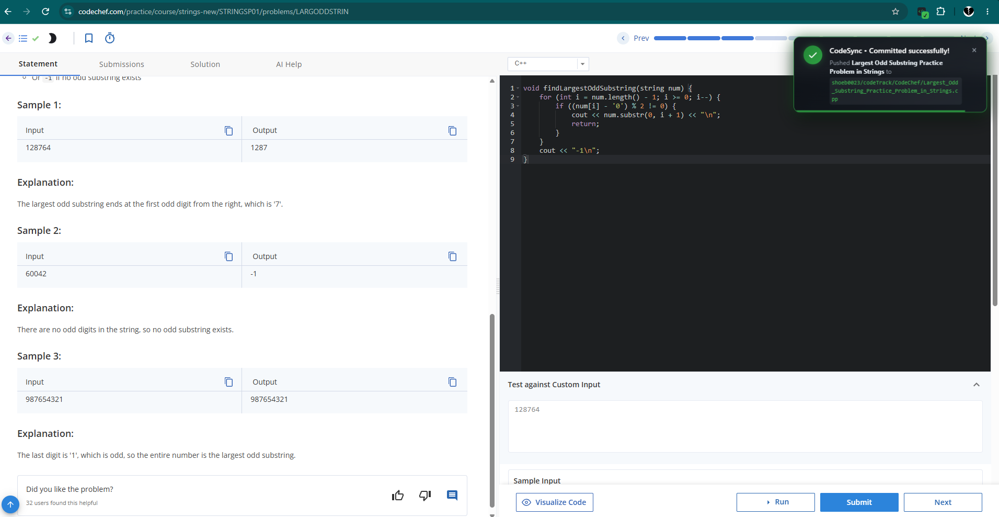
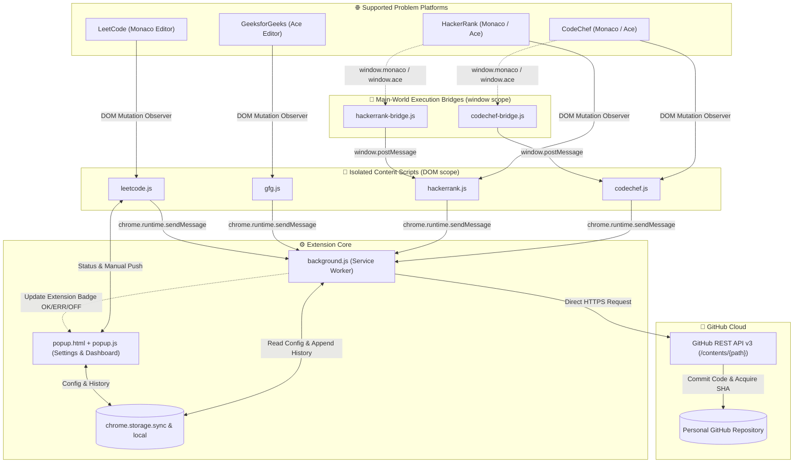

<div align="center">



<br />


# ⚡ CodeSync Tracker

### **Automated, Multi-Platform Competitive Programming Solution Archiver for GitHub**

<p style="font-size: 1.25em; color: #8b949e; max-width: 800px; margin: 12px auto; line-height: 1.6;">
  Seamlessly sync your accepted code from <b>LeetCode</b>, <b>GeeksforGeeks</b>, <b>HackerRank</b>, and <b>CodeChef</b> straight to your personal GitHub repository in real time with zero manual effort.
</p>

---

<!-- Badges Row -->
<p>
  
  
  
  
  
</p>

<!-- Platform Badges -->
<p>
  
  
  
  
</p>

</div>

<br />

---

## 📑 Table of Contents
- [🌟 Overview](#-overview)
- [📸 Visual Tour & Live Showcase](#-visual-tour--live-showcase)
- [✨ Key Features](#-key-features)
- [🏗️ System Architecture](#️-system-architecture)
  - [High-Level Data Flow](#high-level-data-flow)
  - [Component Breakdown](#component-breakdown)
- [🎯 Supported Platforms](#-supported-platforms)
- [📂 Repository Directory Structure](#-repository-directory-structure)
- [🧩 Technical Challenges & Engineering Solutions](#-technical-challenges--engineering-solutions)
- [🚀 Quickstart & Setup Guide](#-quickstart--setup-guide)
  - [Step 1: Generate GitHub Personal Access Token](#step-1-generate-github-personal-access-token)
  - [Step 2: Load Extension in Chrome](#step-2-load-extension-in-chrome)
  - [Step 3: Configure Settings](#step-3-configure-settings)
- [🔮 Future Scope & Roadmap](#-future-scope--roadmap)
- [🛡️ Security & Privacy](#️-security--privacy)
- [🤝 Contributing](#-contributing)
- [📜 License](#-license)

<br />

---

## 🌟 Overview

<div style="font-size: 1.15em; line-height: 1.8;">

**CodeSync Tracker** is an ultra-lightweight, developer-first Google Chrome Extension designed to bridge the gap between competitive programming platforms and GitHub. Built entirely on **Manifest V3**, CodeSync automatically captures accepted submissions across **LeetCode**, **GeeksforGeeks**, **HackerRank**, and **CodeChef**, instantly committing them into your designated GitHub repository with clean directory hierarchy and standardized filenames.

### 💡 Why CodeSync Tracker?
- ❌ **No More Manual Copy-Pasting:** Forget manually creating local directories, copying source code, formatting filenames, and writing git commit messages after solving every problem.
- ❌ **Zero Third-Party Servers:** Unlike other synchronization tools that route your sensitive tokens or source code through external backend servers, **CodeSync operates 100% client-side**. All API requests travel directly from your browser to GitHub's official REST API v3.
- ❌ **Zero Performance Degradation:** Written in pure Vanilla JavaScript with zero external runtime dependencies, ensuring unnoticeable memory overhead and lightning-fast execution.

</div>

<br />

---

## 📸 Visual Tour & Live Showcase

<div style="font-size: 1.1em; line-height: 1.8;">

Take a look at CodeSync in action across problem editors, the popup dashboard, and the resulting GitHub repository:

</div>

### 1. Unified GitHub Repository Portfolio
<div align="center">
  
  <p><em>Automatically organized subdirectories for <b>CodeChef</b>, <b>GeeksforGeeks</b>, <b>HackerRank</b>, and <b>LeetCode</b> with chronological commit messages.</em></p>
</div>

<br />

### 2. Extension Popup Dashboard & In-Page Problem Detection
<div align="center">
  <table>
    <tr>
      <td width="40%" align="center" valign="top">
        
        <br />
        <b>Popup Dashboard</b>
        <p style="font-size: 0.9em; color: #8b949e;">Active status toggle, collapsible sync history with commit SHAs, and language pills.</p>
      </td>
      <td width="60%" align="center" valign="top">
        
        <br />
        <b>Live Problem Detection</b>
        <p style="font-size: 0.9em; color: #8b949e;">Auto-detects active problem titles directly from the tab and enables one-click manual pushing.</p>
      </td>
    </tr>
  </table>
</div>

<br />

### 3. Native In-Editor Push Button & Real-Time Sync Feedback
<div align="center">
  <table>
    <tr>
      <td width="50%" align="center" valign="top">
        
        <br />
        <b>Native In-Editor Push Button</b>
        <p style="font-size: 0.9em; color: #8b949e;">Injected seamlessly next to the platform's native "Submit" button.</p>
      </td>
      <td width="50%" align="center" valign="top">
        
        <br />
        <b>Real-Time Flash Toast</b>
        <p style="font-size: 0.9em; color: #8b949e;">Instant visual toast notification confirming successful commit to GitHub.</p>
      </td>
    </tr>
  </table>
</div>

<br />

---

## ✨ Key Features

<div style="font-size: 1.1em; line-height: 1.8;">

### 🔄 1. Instant Automated Synchronization
- Runs transparently in the background. As soon as your solution is marked **Accepted** or **Passed**, CodeSync captures the problem title, problem number, language, and source code, committing it directly to GitHub.

### 🔘 2. Dual Manual Push Modes
- **Popup Manual Push:** Automatically recognizes when you are browsing a supported coding platform, shows the detected problem title, and lets you push your code on demand.
- **In-Editor Push Button:** Injects a clean, native-styled "Push to GitHub" button directly on the problem page.

### 🛑 3. Master Power Toggle & Bulletproof State Lock
- Need to pause syncing while testing or practicing? A single flick of the master **Extension Auto-Sync** switch pauses all syncing operations.
- When turned **OFF**, every feature of the extension (manual push, token inputs, in-editor buttons, history accordion) becomes **unavailable and unclickable**, ensuring zero accidental commits.

### 📊 4. Interactive Recent Syncs History
- Expandable accordion in the popup displaying your last 10 pushed solutions.
- Includes platform color badges, relative timestamps ("just now", "6h ago"), language badges, and direct clickable links to the commit on GitHub (`https://github.com/user/repo/commit/{sha}`).
- Includes a one-click history clearing utility.

### 🗂️ 5. Standardized Problem Organization & Padding
- Problems are categorized by platform (`LeetCode/`, `GeeksforGeeks/`, `HackerRank/`, `CodeChef/`).
- Numerical problem IDs are padded to 4 digits (e.g., `0001_Two_Sum.cpp`), keeping your repository beautifully organized and chronologically sorted.

</div>

<br />

---

## 🏗️ System Architecture

<div style="font-size: 1.15em; line-height: 1.8;">

CodeSync is architected strictly according to the **Google Chrome Manifest V3** specifications. It uses a clean separation of concerns between isolated content scripts, page-world execution bridges, background service workers, and direct GitHub API REST calls.

</div>

### High-Level Data Flow



<br />

### Component Breakdown

<div style="font-size: 1.1em; line-height: 1.8;">

| Component | Execution Scope | Description |
| :--- | :--- | :--- |
| **`popup.html` / `popup.js`** | Extension Popup Context | Interactive dashboard managing GitHub credentials, auto-sync state, active tab problem detection, and commit history. |
| **`background.js`** | Service Worker | Handles GitHub REST API v3 communication, file existence pre-flight checks, SHA conflict resolution, base64 payload encoding, and dynamic toolbar badge indicators. |
| **`leetcode.js`** | Isolated Content Script | Monitors LeetCode DOM for submission accepted banners, extracts Monaco editor models, and injects manual push buttons. |
| **`gfg.js`** | Isolated Content Script | Listens for GeeksforGeeks accepted verdict popups and extracts code buffers from Ace editor or text areas. |
| **`hackerrank-bridge.js`** | Main World (`world: MAIN`) | Runs directly in HackerRank's page context to query `window.monaco` / `window.ace` and relays code buffers to `hackerrank.js`. |
| **`hackerrank.js`** | Isolated Content Script | Coordinates with the HackerRank bridge script, detects submission modals, and manages user notifications. |
| **`codechef-bridge.js`** | Main World (`world: MAIN`) | Injected across all frames on CodeChef to query nested Monaco editor instances and extract in-memory code strings. |
| **`codechef.js`** | Isolated Content Script | Monitors CodeChef submission verdict tokens, verifies accepted results, and dispatches payloads to `background.js`. |

</div>

<br />

---

## 🎯 Supported Platforms

<div style="font-size: 1.1em; line-height: 1.8;">

| Platform | Match Patterns | Target Folder | Detection Mechanism |
| :--- | :--- | :--- | :--- |
| **LeetCode** | `https://leetcode.com/problems/*` | `LeetCode/` | MutationObserver on submission verdict badges & Monaco models |
| **GeeksforGeeks** | `https://*.geeksforgeeks.org/problems/*` | `GeeksforGeeks/` | MutationObserver on success banners & Ace editor nodes |
| **HackerRank** | `https://www.hackerrank.com/challenges/*` | `HackerRank/` | Main-world bridge inspecting Monaco/Ace + modal observers |
| **CodeChef** | `https://*.codechef.com/*` | `CodeChef/` | Frame-aware main-world bridge + submission state polling |

</div>

<br />

---

## 📂 Repository Directory Structure

```plaintext
CodeSync/
├── 📁 assets/
│   └── banner.png             # Official project showcase banner
├── 📁 icons/
│   ├── icon16.png              # Extension toolbar icon (16x16)
│   ├── icon32.png              # Browser action icon (32x32)
│   ├── icon48.png              # Extension management icon (48x48)
│   └── icon128.png             # Chrome Web Store & detail icon (128x128)
├── 📁 image/
│   ├── img1.png                # Popup UI with Recent Syncs history
│   ├── img2.png                # In-editor "Push to GitHub" button
│   ├── img3.png                # Tab detection & manual push view
│   ├── img4.png                # In-page sync confirmation toast
│   └── img5.png                # GitHub repository synced structure
├── background.js               # Service Worker: GitHub REST API v3 handler
├── codechef-bridge.js          # Main-world bridge script for CodeChef
├── codechef.js                 # Content script for CodeChef DOM & sync logic
├── gfg.js                      # Content script for GeeksforGeeks
├── hackerrank-bridge.js        # Main-world bridge script for HackerRank
├── hackerrank.js               # Content script for HackerRank
├── leetcode.js                 # Content script for LeetCode
├── manifest.json               # Manifest V3 configuration & permission schema
├── popup.html                  # Sleek dark-mode extension popup interface
├── popup.js                    # Popup controller & state manager
├── LICENSE                     # MIT License
└── README.md                   # Project documentation
```

<br />

---

## 🧩 Technical Challenges & Engineering Solutions

<div style="font-size: 1.1em; line-height: 1.8;">

### 1. 🛡️ Manifest V3 Main-World Execution Isolation
- **The Challenge:** In Manifest V3, content scripts execute in an isolated JavaScript context. Platforms like HackerRank and CodeChef store the current code buffer in `window.monaco` or `window.ace`. The isolated content script cannot access these global variables.
- **Our Solution:** Built dual-script bridges (`hackerrank-bridge.js`, `codechef-bridge.js`) registered in `manifest.json` under `"world": "MAIN"`. These bridge scripts extract code directly from Monaco/Ace model instances and pass it to the isolated content script via secure `window.postMessage` events with payload verification.

### 2. ⚡ Single Page Application (SPA) DOM Lifecycle
- **The Challenge:** Modern platforms navigate between questions and update submission results dynamically without full browser page reloads. DOM nodes are constantly destroyed and recreated.
- **Our Solution:** Implemented robust `MutationObserver` routines paired with lightweight polling fallbacks (`setInterval`) to ensure in-editor buttons and submission monitors automatically rebind whenever a problem route changes.

### 3. 🔍 GitHub REST API SHA Collision & Upsert Protocol
- **The Challenge:** GitHub's Contents API (`PUT /repos/{owner}/{repo}/contents/{path}`) requires providing the existing file's blob `sha` when updating an existing file. If you omit the SHA or provide an outdated one, GitHub rejects the commit with an HTTP 409 Conflict.
- **Our Solution:** Implemented a pre-flight `GET` request in `background.js` prior to every commit. If the file already exists, CodeSync extracts its current `sha` and includes it in the `PUT` payload, enabling seamless iterative improvements to existing solutions.

### 4. 🏷️ Universal Language Normalization
- **The Challenge:** Each platform names programming languages differently (e.g., LeetCode: `python3`, GFG: `Python`, HackerRank: `pypy3`, CodeChef: `C++20`).
- **Our Solution:** Created a comprehensive dictionary mapping platform language labels to standard file extensions (`.py`, `.cpp`, `.java`, `.js`, `.ts`, `.go`, `.rs`, `.c`, etc.), ensuring consistent file extension generation.

### 5. 🔒 Universal State Lock on Toggle Off
- **The Challenge:** Simply disabling auto-sync would still allow accidental manual pushes or in-editor button clicks.
- **Our Solution:** Designed a complete lockdown mechanism: turning off the master switch disables all popup inputs, dims the interface (`pointer-events: none; filter: grayscale(0.85)`), hides in-editor buttons across all active tabs, and rejects all incoming commit requests in `background.js`.

</div>

<br />

---

## 🚀 Quickstart & Setup Guide

<div style="font-size: 1.15em; line-height: 1.8;">

Get up and running with CodeSync Tracker in under 3 minutes:

</div>

### Step 1: Generate GitHub Personal Access Token
1. Go to your GitHub account: **Settings** → **Developer Settings** → **Personal access tokens** → **Tokens (classic)** (or [Click Here](https://github.com/settings/tokens)).
2. Click **Generate new token (classic)**.
3. Give your token a descriptive name (e.g., `CodeSync-Extension`).
4. Select the **`repo`** scope (Full control of private repositories).
5. Click **Generate token** at the bottom of the page and copy the generated token string (`ghp_xxxxxxxxxxxxxxxxxxxx`).

> [!TIP]
> Create a dedicated repository on GitHub (e.g., `Competitive-Programming` or `codeTrack`) before linking.

<br />

### Step 2: Load Extension in Chrome
1. Clone or download this repository to your local machine:
   ```bash
   git clone https://github.com/shoeb310/CodeSync.git
   ```
2. Open Google Chrome and enter:
   ```text
   chrome://extensions
   ```
3. Enable the **Developer mode** toggle in the top-right corner.
4. Click **Load unpacked** in the top-left corner.
5. Select the `CodeSync` project directory.

<br />

### Step 3: Configure Settings
1. Click the **CodeSync** extension icon in your Chrome toolbar.
2. In the popup:
   - Paste your **Personal Access Token** into the PAT field.
   - Enter your target repository in `username/repository` format (e.g., `shoeb0023/codeTrack`).
   - *(Optional)* Enable **In-Editor Push Button** to display sync buttons directly on coding platforms.
3. Click **Save Settings**.
4. Solve any problem on LeetCode, GeeksforGeeks, HackerRank, or CodeChef. When your submission is accepted, watch your solution automatically commit to GitHub! 🎉

<br />

---

## 🔮 Future Scope & Roadmap

<div style="font-size: 1.1em; line-height: 1.8;">

- [ ] **Expanded Platform Ecosystem:** Adding support for Codeforces, AtCoder, Kaggle, InterviewBit, and CSES.
- [ ] **Automated Problem Documentation:** Automatically generate a markdown `README.md` file inside each problem folder containing problem description, difficulty tag, constraints, and sample test cases.
- [ ] **Performance Benchmarks:** Append runtime (ms), memory footprint (MB), and percentile rankings directly as comments or commit metadata.
- [ ] **Custom Branch & Directory Templates:** Enable customizable repository pathways like `/{platform}/{difficulty}/{number}_{title}.{ext}`.
- [ ] **Multi-Solution & Revision Tracking:** Support keeping alternative solutions (e.g., `0001_Two_Sum_BruteForce.cpp` and `0001_Two_Sum_Optimal.cpp`).

</div>

<br />

---

## 🛡️ Security & Privacy

<div style="font-size: 1.15em; line-height: 1.8;">

- **No Remote Telemetry:** CodeSync does not collect, log, track, or share any personal data, problem code, or telemetry.
- **Client-Side Encrypted Storage:** Your GitHub token and repository configurations are stored locally inside Chrome's secured `chrome.storage.sync` area.
- **Zero Third-Party APIs:** All network communications occur exclusively between your browser and official endpoints (`api.github.com` and the coding platforms).

</div>

<br />

---

## 🤝 Contributing

Contributions are welcome! Whether it is adding support for a new coding platform, improving editor extraction algorithms, or refining the popup UI:
1. Fork the repository.
2. Create your feature branch (`git checkout -b feature/awesome-feature`).
3. Commit your changes (`git commit -m 'Add awesome feature'`).
4. Push to the branch (`git push origin feature/awesome-feature`).
5. Open a Pull Request.

<br />

---

## 📜 License

This project is open source and available under the [MIT License](LICENSE).

<br />

---

<div align="center">
  <b>Built with ❤️ for the competitive programming community.</b>
  <br />
  <sub>Star ⭐ this repository if CodeSync helped keep your GitHub streak alive!</sub>
</div>
